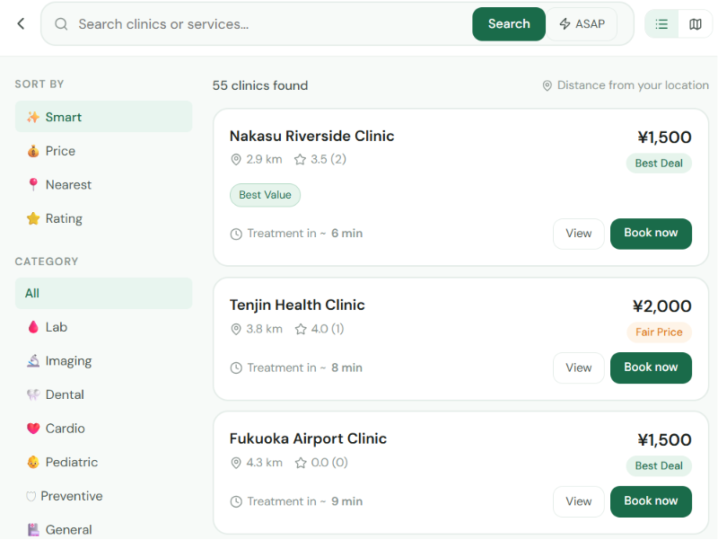
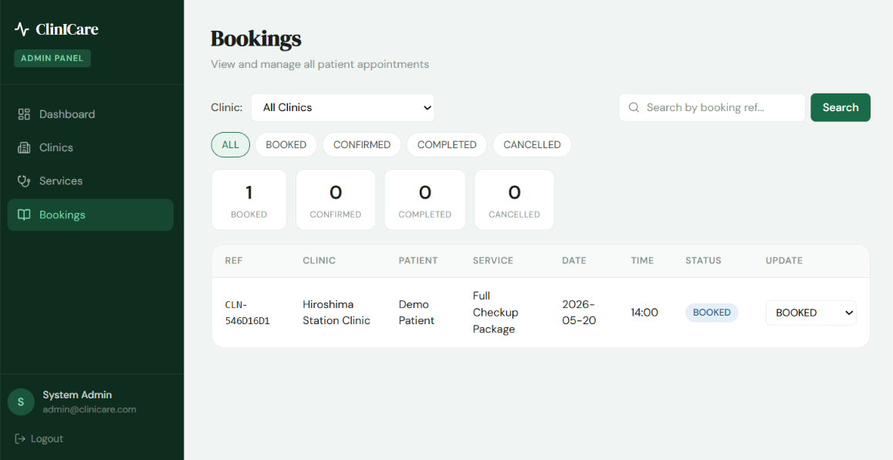

# 🏥 ClinICare — クリニック予約システム

> クリニック検索・予約ができるWebアプリです。


---

## 🌐 ライブデモ

👉 https://clinicare-frontend-ten.vercel.app/

> ※ 初回アクセス時はバックエンド起動のため少し時間がかかる場合があります。

---

## ✨ 主な機能

### 👤 患者向け
- クリニック検索
- オンライン予約
- ゲスト予約
- 予約確認
- レビュー投稿

### 🏥 クリニック管理
- 予約管理
- サービス管理
- ダッシュボード表示

### 🛠 管理者機能
- 全クリニック管理
- 全予約確認
- 統計表示

---

## 📸 スクリーンショット

### 検索ページ


### 管理画面


---

## 🛠 使用技術

| カテゴリ | 技術 |
|---|---|
| Frontend | React 18 + Vite |
| Routing | React Router v6 |
| API通信 | Axios |
| 地図 | Leaflet.js |
| Style | CSS Modules |
| Deploy | Vercel |

---

## 🔐 デモログイン

ログイン画面の「Patient / Clinic / Admin」ボタンから、
デモアカウントですぐにログインできます。

---

## 📁 フォルダ構成

```bash
src/
├── components/
├── pages/
├── api/
├── context/
└── utils/
```

---

## 🖥 開発環境

```bash
npm install
npm run dev
```
## 🔗 関連リポジトリ

Backend:
https://github.com/niroj-bot/clinicare-backend

---

## 👨‍💻 Author

GitHub:
https://github.com/niroj-bot
